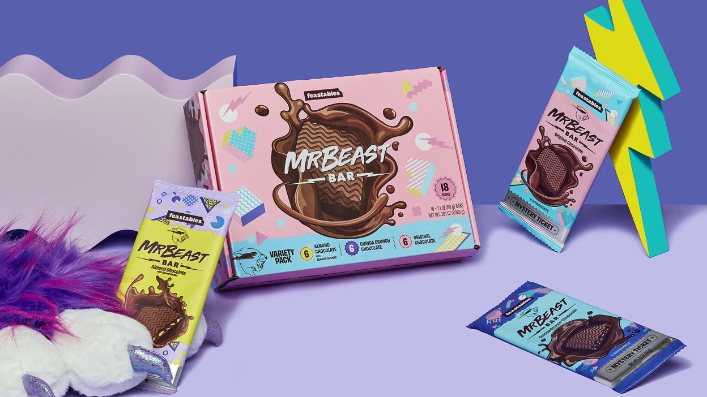
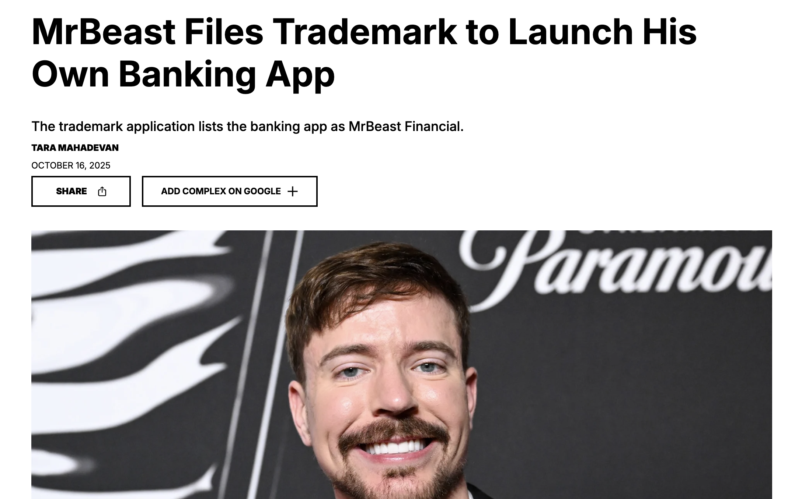

As [AI makes it easier to build stuff](https://youtu.be/t0U3UREdjmo?si=cre4RmPdN-r1rCpk), the biggest difficulty to building a tech company will shift to growing the product (like it wasn’t before?).

As acquisition gets noisier, pricier, and harder to attribute, the real advantage shifts to something more fundamental than any single channel - getting attention.

Not attention as vanity. Attention as leverage. Because attention is the input that can be converted into trust, demand, partnerships, talent, and sales across whatever channels happen to work this year.

That’s why more companies are drifting toward the same destination: they’re building influencer networks, creator programs, and media engines. Not to “do content,” but to own a durable way to reach people.

In that sense, attention is all you need.

## Every Company Is Becoming a Distribution Company
Distribution used to be rented:

* Ads delivered reach,
* SEO delivered demand,
* email delivered retention.

Now each of those pipes is less predictable, more competitive, and more controlled by gatekeepers. So companies are adapting by building what the platforms can’t easily take away:

* relationships,
* identity,
* influence,
* and repeatable attention.

## Influencing is Becoming the Core GTM Layer

That’s because influencers solve three problems at once:

### They bypass channel decay
When CPMs rise and targeting weakens, you need messages that travel because people want them.
Creators can still get organic distribution because platforms reward:

* retention (watch time),
* engagement,
* and shareability.

A strong creator is effectively a portable distribution node they carry audience attention across formats and trends.

### They package trust
Attention without trust doesn’t convert. Trust without reach doesn’t scale.
Influencers build a relationship with an audience that believes them. That belief is hard to buy with ads.

### They create “proof” at internet speed
A founder can say “we’re great.” An ad can claim it too.
But a creator using your product on camera, repeatedly, in context showing outcomes, not slogans creates a kind of proof that’s native to how people make decisions now.
This is why “creator content” often outperforms “brand content”: it’s not just content, it’s credibility distribution.

For new products, a lot of the time the founder steps into this role. If you zoom out, the biggest change is companies moving from buying attention to producing/earning attention.

That requires new muscles:
* Always-on output, not quarterly campaigns
* Creators who look like the customer,
* Founders who explain the POV,
* Operators who show the behind-the-scenes,
* Employees who humanize the work,
* Customers who become ambassadors. The company becomes an ecosystem of creators.

##The future

> “Only Those With Attention Win” by smart founder

The companies that can manufacture attention reliably will outcompete those that only know how to buy it. Because buying attention is a tax. Manufacturing attention is an asset.

In the future:
* Companies hire for content like they hire for engineering.
* Brands become mini-studios. Not necessarily Hollywood-level. The advantage won’t be production quality. It’ll be consistency and closeness to the audience.

Most companies won’t become traditional media companies. But many will become creator-backed influence engines brands that behave like studios, recruit talent like sports teams, and treat attention as a core asset on the balance sheet (even if accounting won’t admit it).

In a world where acquisition channels get squeezed, the companies that win won’t be the ones with the biggest budgets. They’ll be the ones who can consistently create attention, convert it into trust, and turn that trust into growth. Because attention is all they need to grow.

[More influencers are launching products](https://www.complex.com/pop-culture/a/cmplxtara-mahadevan/mrbeast-trademark-bank-app) to compete with main stream companies? Depending on the success of this trend, we will see the effect on many more companies*.

*Quick caveat, a lot of celebrity products have failed and I think it is less a factor of distribution but because they invested less in the product and focus. Another company with enough focus and an okay will figure out distribution, even if it means building out their own.

