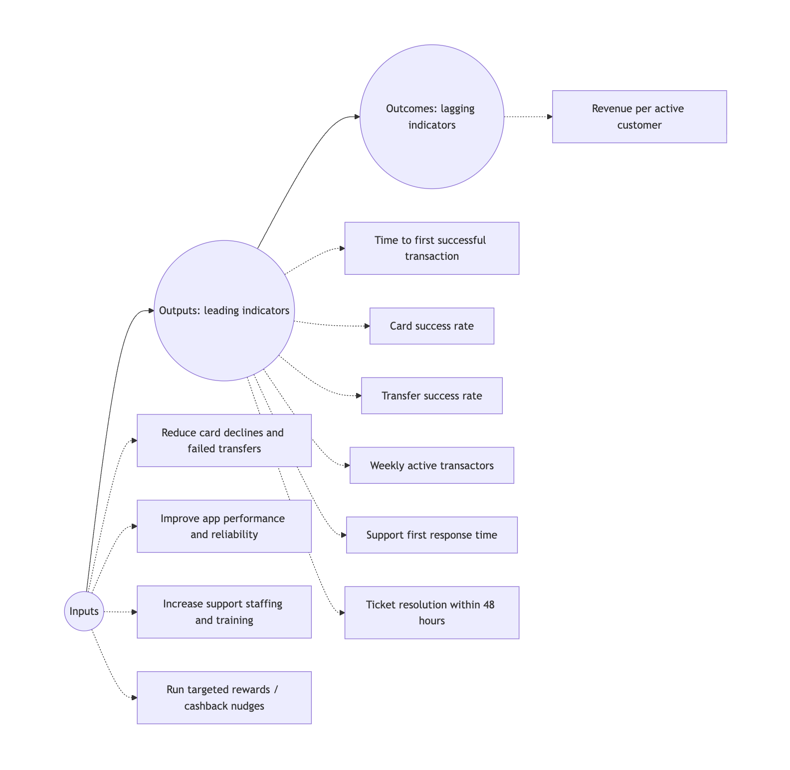

Revenue is an outcome. Your revenue doesn't grow magically. There are certain things that lead to revenue growth.

You do certain things to drive revenue growth. But those things don't lead to revenue growth overnight. The actions you doing are don’t have direct immediate impact on revenue. 
It takes time for actions to translate into revenue. Typically revenue is referred to as a lagging indicator because of this. But you can’t sit around waiting because revenue is a lagging indicator and won’t increase overnight. This is where leading indicators come into play. You need to identify leading indicators and track them.

The model is inputs -> output (leading indicators) -> outcome (lagging indicators)

## Lagging and leading indicators

A **leading indicator** is a metric that tends to change before the outcome you care about changes. It’s a forward-looking signal often a proxy for future performance.

* Action-focused: often tied to behaviors and inputs.
* Earlier warning: useful for prediction and course correction.
* Less certain: noisier and sometimes misleading without context.

Some examples include:

* Sales -> qualified pipeline, demo requests, trial-to-paid conversion steps in progress.
* Product -> activation rate, “time to first value,” weekly engaged users (as a precursor to retention).

Leading indicators help you answer: Are we doing the things that usually produce the results/outcomes we want? *Revenue won’t appear magically. Are we doing the things that would bring us revenue.*

A **lagging indicator** is a metric that changes after the underlying thing you care about has already changed. It’s an “after-the-fact” signal.

* Outcome-focused: measures results.
* High confidence: usually accurate and easy to validate.
* Slow to react: you often learn the lesson after the window to act has passed.

Some examples include quarterly revenue, profit margin, churn rate (after customers leave).

Lagging indicators are great for accountability (“Did we achieve the target?”) and for comparing periods, teams, or strategies. But if you only track lagging indicators, you may discover problems late.

So you can’t solve revenue problems by focusing on revenue. Once interesting bit is that a lagging indicators can be a leading indicator in some scenarios. For instance churn is a leading indicator for revenue. But churn can be a lagging indicator for user experience.

## Common mistakes people make

**Treating a lagging indicator like it’s actionable**
Example: “Revenue is down, fix it.”

Revenue is an outcome. You need to identify leading drivers like pipeline creation, pricing changes, win rate, or retention.

**Picking “leading indicators” that don’t actually lead**
Not every early metric predicts outcomes. A metric is only “leading” if it reliably precedes and relates to the outcome.

Example: “Website visits” may be leading for some businesses—but if most traffic is irrelevant, it’s noise.

**Tracking too many proxies**
If you track 25 leading indicators, you’ll drown in dashboards. Focus on the handful that are:

* strongly related to the outcome,
* stable enough to be useful,
* and tied to concrete actions.

**Confusing correlation with causation**
A leading indicator may correlate with an outcome without causing it. That can still be useful for forecasting, but risky for strategy. If you act on the wrong “driver,” you won’t improve results.

## How to choose good leading indicators

Start with the lagging indicator you care about, then work backward through the causal chain.

* Name the outcome (lagging): e.g., “Monthly churn under 2%.”
* Identify key drivers: reasons churn happens (poor onboarding, unresolved bugs, low value realization, issue carrying out key actions).
* Select measurable behaviors/signals: things that show those drivers are improving or worsening.
* Validate: check whether changes in the proposed leading indicator tend to precede changes in churn.
* Operationalize: define owners, cadence, and thresholds that trigger action.

What good leading indicators look like
* Specific: not vague (e.g., “% of new users completing onboarding within 48 hours”)
* Sensitive: changes quickly enough to be useful.
* Actionable: teams can influence it.
* Predictive enough: shows a consistent relationship with the outcome.

## Don’t ignore revenue (lagging indicators)
Lagging and leading metrics serve different purposes. They complement each other: leading indicators help you steer in realtime, lagging indicators help you verify outcomes. Because leading indicators can sometimes show wrong signal, lagging indicators help us confirm strategy. Lots of sales activity or signups might not always translate to increased revenue.

## System thinking to the rescue
System thinking is important when thinking about lagging/leading indicators. If you understand the systems that drive your product/business, you can track and focus on the right leading indicators to increase your revenue.

Remember, revenue might can also be a leading indicator!
