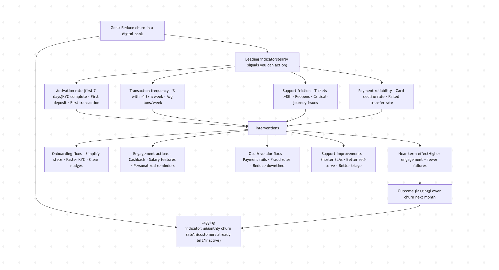

Revenue is an outcome. Your revenue doesn't grow magically. There are certain things that lead to revenue growth.

You do certain things to drive revenue growth. But those things don't lead to revenue growth overnight. The actions you doing are affecting the leading indicators. But your revenue is a lagging indicator. You need to identify leading drivers like activation,pipeline creation, pricing changes, win rate, or retention.

## Picking “leading indicators” that don’t actually lead

Not every early metric predicts outcomes. A metric is only “leading” if it reliably precedes and relates to the outcome.

Example: “Website visits” may be leading for some businesses but if most traffic is irrelevant, it’s noise.

## Another mistake is tracking too many proxies

If you track 25 leading indicators, you’ll drown in dashboards. Focus on the handful that are:

strongly related to the outcome,

stable enough to be useful,

and tied to concrete actions.

Mistake 4: confusing correlation with causation

A leading indicator may correlate with an outcome without causing it. That can still be useful for forecasting, but risky for strategy. If you act on the wrong “driver,” you won’t improve results.

## How to choose good leading indicators (a practical method)

Start with the lagging indicator you care about, then work backward through the causal chain.

Step-by-step

Name the outcome (lagging): e.g., “Monthly churn under 2%.”

* Identify key drivers: reasons churn happens (poor onboarding, unresolved bugs, low value realization).

* Select measurable behaviors/signals: things that show those drivers are improving or worsening.

* Validate: check whether changes in the proposed leading indicator tend to precede changes in churn.

* Operationalize: define owners, cadence, and thresholds that trigger action.

What good leading indicators look like

* Specific: not vague (e.g., “% of new users completing onboarding within 48 hours”).

* Sensitive: changes quickly enough to be useful.

* Actionable: teams can influence it.

* Predictive enough: shows a consistent relationship with the outcome.

# Don't ignore revenue! 

Using leading + lagging indicators together (the “paired metrics” approach). A strong measurement system usually pairs each key outcome with 1–3 leading indicators.

### Examples of pairs

Lagging: quarterly revenue
Leading: qualified pipeline, win rate, expansion opportunities created

Lagging: customer churn
Leading: onboarding completion rate, support resolution time, product usage frequency

Lagging: defect rate
Leading: test coverage on critical modules, code review turnaround time, escaped defect “near misses”

Lagging: employee turnover
Leading: engagement survey signals, manager 1:1 consistency, internal mobility rate

This pairing creates a loop:

Leading indicators tell you what to adjust this week.

Lagging indicators tell you whether those adjustments worked over time.

## When each type matters most
Leading indicators matter most when:

* you need early warning,

* you’re operating in fast cycles (weekly growth, agile delivery),

* you’re trying to change behavior or process.

* Lagging indicators matter most when:

* you need accountability and reporting,

* outcomes are the “bottom line,”

* you’re evaluating strategy effectiveness over longer horizons.

# A short takeaway

Lagging indicators are your scoreboard. They’re accurate, but late. Leading indicators are your levers. They’re early, but imperfect.

The best systems use both: lead to manage, lag to learn. Stop focusing only on why revenue hasn't increased.