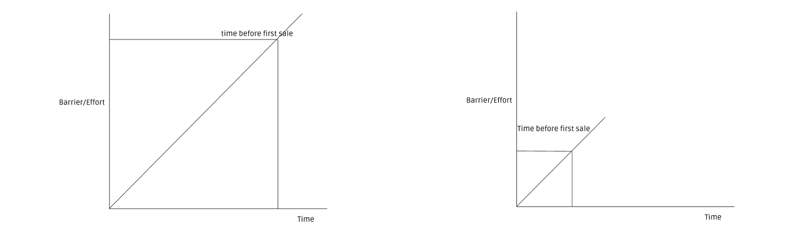

> “The internet has become an institution of its own that’s reshaping who can become an expert, how they share their expertise and the ways they can earn a living from it.” — Fadeke Adegbuyi

---

A few weeks ago, my friend sent me a message that she was going to start selling clothing items. So she set up her store and was open for business (she was ready to sell!) that same night. Pretty standard, right? But five years ago, this would be unthinkable!

My guess is you aren’t surprised to hear that my friend launched a clothing brand almost overnight because it appears “normal” today, right? 

But imagine the year was 2015? For starters, let’s dive into the possibilities back then; One is she rents a shop, desperately hoping she picks an excellent location, stocks the shop and then hopes that customers come around.

The other option is she goes around with her stock, visiting houses and offices, hoping to find willing buyers who would pay. Think of all she had to do. (Much of this is from my experience living in Africa.)

But this no longer is the case, not anymore! She was ready to sell in a day!

If it were 2015, going with either option would have presented significant roadblocks for her. There is no way she would have been ready in under 24 hours (in fact, it’s nearly impossible) because of the required capital and effort.

Graph of effort required vs time to sell. Pre-2016 vs Post-2016.

# Enter Pre-2016

> ‘Experts can be born and brought up on the internet, bypassing post-secondary institutions and other centralised forms of education and knowledge dissemination.’ - Fadeke Adegbuyi.

## Credentialing

No credentials, no access; that’s the way it is. You are only allowed access if you possess specific qualifications, and therefore, newcomers without these qualifications aren’t permitted to join in.

Broadly, each society has three (3) major groups: people seeking credentials to get access, people selling those credentials and probably, people who won’t let you in without those credentials (gatekeepers). 

Think of highly specialised fields, and you have lots of accreditations you need to pass through before you can be “permitted” entry. 

Twist, because of the internet, people are ‘permissionless-ly’ abandoning traditional methods of getting access. The result is, people are getting jobs without getting certificates from conventional schools. 
More on this later.

## Network and Circles
> ‘Expertise remains crucial to knowledge production, but it must reflect genuine excellence in a field, rather than mere affiliation with institutional authority.’ - Jacob Mchangama.

Ever tried to enter a party without an invitation? If you aren’t a party-goer like me, I’m pretty sure you have heard the usual “We can’t hire you because ...”. Well, I will leave you to fill in the gap. But, you get the drift. That’s how this works. 

You only get access if you belong to a particular network or are considered to have a certain pedigree or if “they” acknowledge you as an expert. The system is defined to favour only a certain kind of people. 

What you get when (that is, if you get the courage to challenge the system) you attempt to get in is ‘access restricted, permission required’. 

Elite institutions like Harvard are able to offer both credentials and the network, which often brings the capital.

## Capital
Capital has always been a differentiator, and this is nothing new. You need capital to get off, and without it, you don’t stand a chance.

Ask anybody who has started a business, and they will tell you this - Capital is King. The upfront fixed costs required to start can be crippling.

For many of us, lack of access to capital is one of the principal reasons people don’t venture to try out ideas.

## Gatekeepers
> ‘The internet is a democratising force — fewer gatekeepers, more participants’ - Matt Clifford.

People have standards, definitions and preconceived notions of who they think an expert is, and those who don’t fall into it aren’t acknowledged as ‘experts’. So you have to fit into their perception of expertise.

These preconceived notions affect whether you get accepted. As a result, people resort to playing status games to fit in, which explains why we see lots of people trying to get into shows like the Voice and Nigerian Idols.

# Zoom out Post-2016

> ‘It’s undeniable that technology has democratised access to high-quality information, data, and tools for research, creation, and distribution.’

In 2021, my friend started selling clothing in less than 24 hours. But this didn’t begin in 2021. We have been building up to this. Rapid technological changes have brought us here. Let’s look at examples:

---

## Education
My friend, a software engineer, is a dropout with no form certification working at a top Nigerian tech startup. He isn’t the only one because I know many self-taught software engineers with no college degrees. 

Why is this possible? The internet has democratised learning, and now anyone can learn anything from the best schools. Software developers use this access to education to become ‘recognised’ experts by building stuff (proof of work). 

With little or no capital and risk (the cost of experimentation while learning is next to nothing - near zero. Compare this with learning to become a doctor.), they do this with tools built to support hackers like them.

## Nollywood (Entertainment)
Entertainers are becoming millionaires from YouTube, TikTok and Instagram. With a phone, the internet, and the ability to entertain viewers, we see new entertainers taking Nollywood by storm without permission. Something unheard of pre-2016.

They are gaining widespread popularity without seeking the permission of the gatekeepers or the ‘experts’. Therefore, these entertainers no longer need to get into well-known circles or play by old rules; instead, casting roles are offered on a platter after gaining popularity.

Entertainers get direct access to viewers, and the viewers get to decide not institutions or so-called experts.

## Starting a business
Talented cooks are launching their restaurant businesses online with just a phone. It’s crazy, but it’s happening in 2021! These online indie restaurants are gradually turning people away from traditional restaurants and positioning themselves as worthy alternatives.

Like my friend, they launch fast and build burgeoning businesses on WhatsApp/Instagram because it’s so easy to start. 

On Pledre, entrepreneurs are launching schools with next to zero capital (compared to what they would have needed to start a physical school).

---

# Still Early Days

We have done an excellent job building great tools and infrastructure, which has put us in a fantastic place because people are doing incredible stuff ‘permissionless-ly’. But a lot still needs to be done. We need to help more people become genuinely permissionless, and I believe doing this would create a massive opportunity for anyone smart enough to capitalise.

Here are some of my thoughts:

## Starting should be easier
The easier it is to start, the lower the barrier to entry (check out the graph at the beginning), the more the number of people that can join. In short, this means that people can start in no time permissionless-ly because they face fewer hurdles and minimal challenges.

People with little or no capital, no credentials can start or build expertise differently on their terms. We need more tools that enable seamless access to otherwise “permission-require” spaces. 

Take, for example, riverside.FM, a company that reduces the barrier required to start a podcast for those looking to show their expertise via podcasts by being ​​an “online recording studio”. Similarly, YouTube made it easier for people to showcase their artistry and become successful actors or artists. Lots of musicians have grown solely because of their prominence on Instagram, YouTube e.t.c.

Building infrastructure that helps people start with ease in no time with near-zero costs and less effort is vital. This is because infrastructure can solve capital hurdles (the infrastructure can act like capital as a service). After all, people will need less capital and less expertise.

For example, AWS made it easier for people to launch internet businesses, which meant nearly zero upfront costs. Same way, pledre, a startup that provides people with the infrastructure* to build virtual schools online ‘permissionless-ly’, with little to no capital and technical know-how.  

Andy Jassy, the former AWS CEO, said this:

> “We tried to imagine a student in a dorm room who would have at his or her disposal the same infrastructure as the largest companies in the world,” Jassy says. “We thought it was a great playing-field leveller for startups and smaller companies to have the same cost structure as big companies.”  

I see logistics as a critical infrastructure that not many are building yet.

## Making money / Earning should be more accessible.
Managing and earning their work shouldn’t be a bottleneck for creators to grow, but it currently is. So it’s not surprising that most entertainers still rely heavily on ads. We need innovative business models that help entertainers earn enough. It’s so unfortunate that even developers still can’t earn money comfortably from across the globe.

What if we could help entertainers launch side-hustles off their brand? As long as managing is easy or done for them and there is a revenue split. Most of them would jump on this.

Notice that there are two issues here - a business model that makes earning easy and getting paid effortlessly.

Strike is an exciting startup using crypto to solve receiving and sending payments globally. Twitter is using Strike’s API for their tipping feature.

Most of these burgeoning businesses like the one my friend is building still receive, transact, and manage their businesses primarily on WhatsApp; this is highly inefficient. This statement shouldn’t come as a shock because WhatsApp, Excel or Instagram isn’t what they should use for managing their business. 

An exciting startup building in this space is Heyfood. Heyfood is helping indie restaurants (that rely heavily on WhatsApp and Instagram) manage their business and receive payments effortlessly. As a result, talented cooks trying to build a restaurant can focus on what they are good at - cooking and leave the rest to Heyfood.

# Conclusion
The internet has opened up an enormous opportunity. The goal is to build tools and infra on the internet that will help people start and build ‘permissionless-ly’.

More importantly, we need to build tools and infrastructure to allow young Africans to take creative risks ‘permissionless-ly’ because young Africans do so much with so little. 

Just imagine what would happen if we got out of their way? We can be so much more. I believe this so deeply it hurts. (These words were stolen from Emmanuel Quartey.)

If you enjoyed this, please subscribe and share.

---
