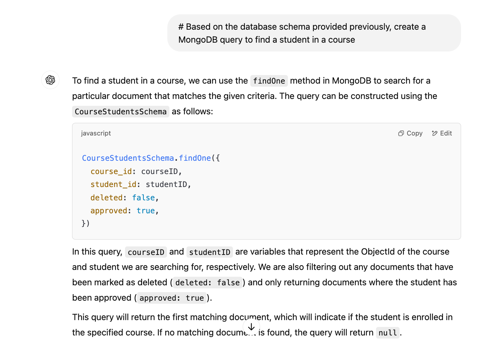

I’m not good at writing short articles, but hopefully this attempt will be successful. I’ve been developing AI products for some time now and, in the process, have learned a simple trick that I’ve also seen my friends use:

**Before writing code, build out the flow in ChatGPT.**  
Replicate the product’s functionality in ChatGPT.

---

## Example: MagicalDB

When I was building **MagicalDB** (an AI data analyst), the fastest way to understand how the product should work wasn’t to start building with OpenAI’s APIs. Instead, it was to simulate the experience in ChatGPT.

Here’s how the product worked and what I did:

1. Provide the DB schema to the AI system.  
2. Ask the question with the schema in a prompt.  
3. Get the query that answers that question.  
4. Run the query on the database.  

I could test the flow with steps 1–3 without writing any code. This trick helps with accessing capabilities and technology, aside from getting clarity on how to build the product.

---

## Bonus Hack: Basic Eval Setup

Another hack I found useful before setting up a proper evaluation system is an **eye test evaluation system**:

- Build an API that generates 5–10 responses based on a task.  
- Check the results manually.  

This is useful for assessing different things every time you change the system, prompt, or model — especially if you can go live quickly.

---

## Conclusion

Prototyping AI products doesn’t have to start with code. By simulating flows in ChatGPT and using lightweight evaluation hacks, you can gain clarity, validate ideas, and move faster.

*Until the next one…*

---
