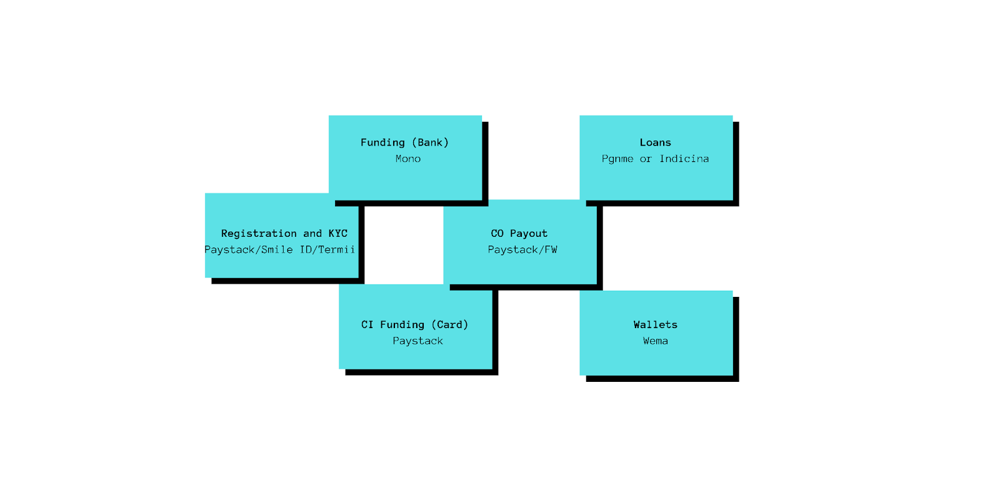

Over the last twelve months, the African tech scene has experienced a surge in infrastructure startups. This article looks into this trend and why it is good for the ecosystem. But, to be fair, this article is about me and my love for infrastructure startups.

While there had been significant ecosystem activity before then, the launch of **Paystack** and **Flutterwave** (both infra startups) can be said to be the catalyst of what I refer to as *Naija Tech Age 2.0*. While the infra they built powered digital payments, the relatively newer infra companies are tackling a broad range of problems and providing the launchpad for other startups and developers to offer better services unrestrained.

---

## The Playbook 📕

Let me start with a snippet from *[The Everything Store](https://brad-stone.com/book/)*. After all, “the everything store” popularised this whole infra thing when they launched [AWS](https://en.wikipedia.org/wiki/Amazon_Web_Services) in 2004:

> “If Amazon wanted to stimulate creativity among its developers, it shouldn't try to guess what kind of services they might want; … Instead, it should be creating primitives — the building blocks of computing — and then get out of the way.”

[Amazon realised early on that a company (the software) comprises multiple components](https://stratechery.com/2016/the-amazon-tax/). These components come together to form software that provides value to users.

For example, a loan app (Fintech) like **[Carbon](https://ng.getcarbon.co/)** has different parts:
- Registration (OTP and related services)  
- KYC  
- Loan decisioning (whether to give out a loan or not)  
- Fraud handling  
- Cash in / Cash out (CICO)  

To name a few! Let's not forget an essential part: the servers that host the code.

Secondly, Amazon found out that not all companies have or need to build the infra they need (for various reasons - **time, cost and talent**), so they shouldn't have to worry about that.

Why? Remember that, for most companies, these various components are not part or just part of their core business. Therefore, why should they build it if it isn't necessarily where they want to differentiate themselves? As such, by using infra created by other companies, they look to avoid:

**Building**: At a startup, building software always requires making tradeoffs. You have to commit talent (and resources), which means deprioritising other things or getting more talent to get stuff done—as such, being able to avoid building certain things from scratch is always a win.

**Maintenance and enhancements**: It's not your job! Improvements and maintaining the software isn't your headache. It would be someone else's business to worry about fine-tuning the infra.

**Dealing with edge cases**: Moreso, you avoid solving for edge cases (I'm a PM, and I understand the difficulty that comes with dealing with edge cases). An edge case is a scenario that won't usually occur because of rare/unexpected/unusual user behaviour (engineers call this the unhappy part). 

For example, say you want to build a feature that allows users to enable recurrent transactions. You’ll notice that recurrent deductions can be tricky for the unhappy path where the user doesn’t have money in their bank account. Because of this, you have to solve problems like how many times you should try after a failed deduction or should you try forever, considering the deduction frequency set by the user. I can go on, but you get the point.

**Regulation**: This is an issue that predominantly affects financial technology companies, but it's enormous and can be the difference between life and death, as Nigerian startups have realised. Plugging into already existing infra means avoiding a vast part of this. The same goes for licensing and partnerships.  

For instance, if regulation requires a payment gateway to have a certain amount of money for float, then plugging into Flutterwave as my gateway will help you avoid that. Also, if I have to enter into agreements with [NIBSS](https://nibss-plc.com.ng/) to allow direct debit from bank accounts, plugging into Stitch simply solves that.

This makes sense because your goal as a company is to focus on the problem you set out to solve, how you can differentiate yourself and how you can get users. (In essence, to focus on the significant issues. The enabling infrastructure to do so should be, by the way, and not necessarily, a burden to bear).

Let me paint a picture - Imagine Stears, a media company spending vital time and resources on enabling their users to pay them for subscriptions. Of course, that would be absurd because that's not their core. Their value proposition isn't tied to enabling payments but to offering in-depth insight and providing content on issues that readers won't find anywhere else. Principally, that's what they should focus the bulk of their time, talent and resources on, not enabling their users to pay them for subscriptions.

---

## Boom Boom 💥💥

It’s no coincidence that Nigeria’s current tech boom started with **Paystack** and **Flutterwave**, both payment infra startups. Payment is at the core of any digital economy.

Since then, we’ve seen a surge in startups leveraging infra to build amazing products. Some hot infra startups that raised in the past year include:

### Mono / Stitch / Okra
[Mono](https://mono.co/)/[Stitch](http://stitch.money/)/[Okra](http://okra.ng/) provide secure and reliable open banking infrastructure for access to financial data. Think [Plaid](https://technically.substack.com/p/what-does-plaid-do) for Africa. 

Because of Mono, lending apps can easily access financial data for lending decisions and receive payments directly from their user's bank accounts. Likewise, financial management apps help users analyze how their money is been spent and provide insights. 

### Pngme
Getting credit history data and deciding who to give loans to has always been an issue for digital lenders. [Pngme](https://pngme.com/) is democratising access to mission-critical data infrastructure and machine learning models to power lending.

They provide developer-friendly data infrastructure, out-of-the-box machine learning models, insights, and data science tools that help lenders make better lending decisions. These components are the building blocks for anyone to create innovative (lending) products and customised user experiences.

### Union54
U[nion54](https://union54.com/) provides an API to issue debit cards without needing a bank or a third-party processor. These APIs enable startups to launch virtual or physical cards faster with fewer hassles.

### Bloc
[Bloc](https://blochq.io/) is a full end-to-end service that provides everything from payment to card issuance APIs. The ultimate goal is to handle everything African FinTechs need to launch and thrive. Time would tell whether this move works and is good for the industry.

Be sure to check out these exciting infra startups - [Klasha](https://www.klasha.com/), [One Pipe](https://onepipe.com/), [Lendsqr](https://lendsqr.com/), Okra and Indicina.

---

## Textbook Move 📚

Something to keep an eye on – in what seems to be a text-box move, some African companies are now opening up their internal infra for others to use. For example, Gokada has opened up its delivery APIs for other startups to build on; this comes with their physical infrastructure (riders).

Some startups in the crypto space - BuyCoins and Quidax - have also opened up their trading APIs, not forgetting [Helium health](https://heliumhealth.com/developers.html). So again, it'll be interesting to see how this plays out.

---

## Brass Needs ~~Brass and Asphalt~~

Brass recently raised millions, but that is not our concern here. Instead, I'm talking about Brass because they underscore the importance of infra: the ability to build and launch fast. 

For Brass to deliver top-notch branchless business banking, it has to leverage a suite of services that will help them to facilitate a seamless user experience. For example, see the instances in the diagram below:

Note that the partners attached to each service are mere guesses and therefore should not be considered an accurate picture of the services used at Brass.

---

## What This Means

Let's delve into what this means for the ecosystem.

### Launch and test faster
Since 'product' is now a commodity, startups can launch competitive offerings quickly. Launching faster means testing those offerings with users and getting feedback early in a game where speed matters. As a result, startups are afforded the speed they need. 

### Innovation
The ability to focus on what differentiates you as a startup can't be overestimated, especially in a game where focus matters a lot.

Being able to focus on your unique value proposition allows for the possibility of innovation in your space. Startups simply can't get bogged down with figuring out the seemingly 'non-vital' parts that are only complementary to their business offerings. Also, [the ability to mix and match can help startups](https://mattford.substack.com/p/rejecting-the-gold-rush-of-pick-and) to develop better and more interesting propositions for their users.

### Better user experiences
With fewer things to worry about, you can focus on creating delighting experiences for your users, whether by mixing and matching or using infra in ways no one thought possible.

I'll end by saying that a side effect of 'product' being a commodity and easier to build is that businesses must become more innovative and make what users love. Because, when better infra simply stops being a significant distinguishing factor for startups, shifting the basis for competition to other elements, the challenge falls on startups to come up with really innovative value propositions. 

Another side effect is that you might not have a moat if you don't think deeply about it, which might also mean increased customer acquisition costs.

The end! That’s all I planned to say. Let me know what you think about infra startups in the comments section.

*Thanks to Samuel Adeoti, Timi Idowu and Olayanju Idris for reading and improving drafts of this.*

Further reading

* [First plaid, then the world](https://avoidboringpeople.substack.com/p/first-plaid-then-the-world).
