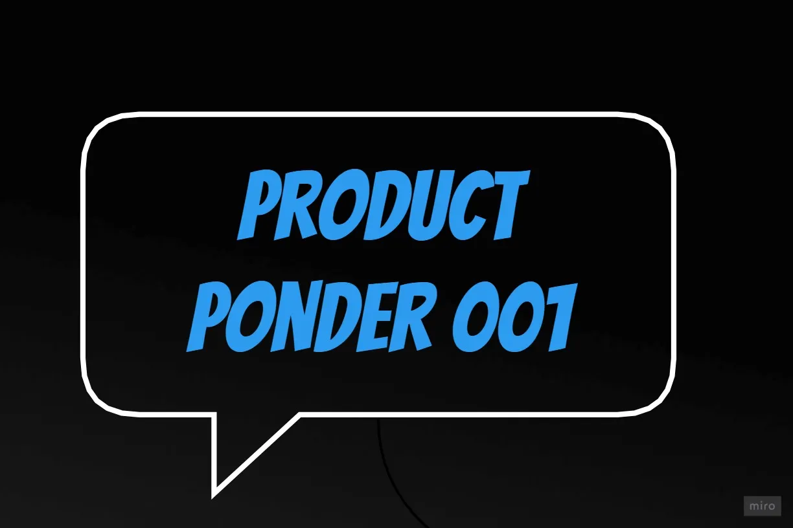
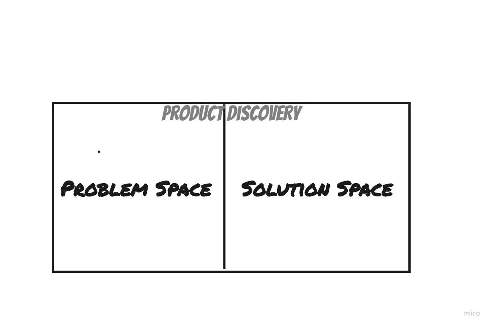
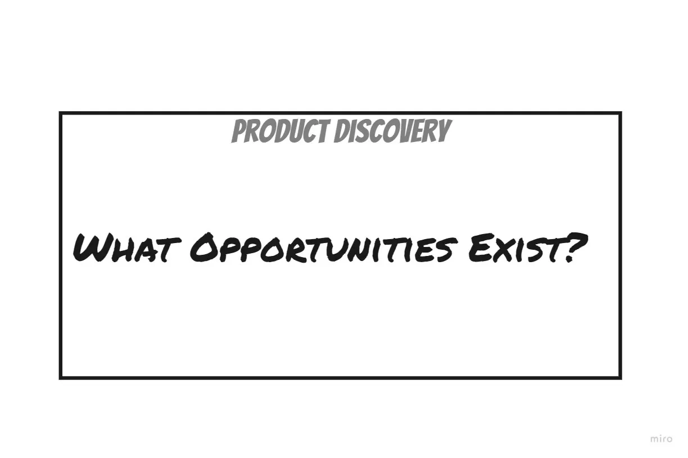
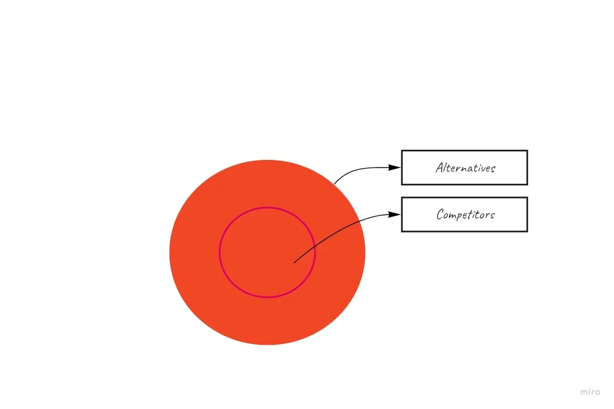
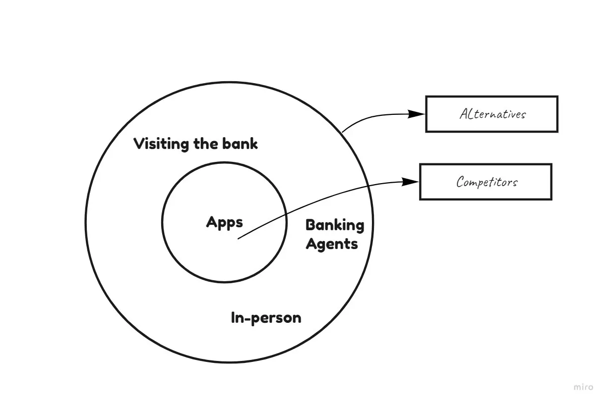

Product Ponder is a collection of thought-provoking articles that have impacted the way I see product management. A lot of recycling happens in most of the articles we read, so I wanted to share these that I find unique and intriguing. Each article comes with a summary and my musings.

## Problem vs Solution — Marty Cagan

If you were going to read only one article out of the remaining, then this should be it.

This article dispels the false notion in product management that product discovery or ideas about what to build should be focused on the “problem space”, ignoring the “solution space”.

This focus according to Marty has existed because

> For as long as our industry has existed, people have wanted to separate product work into “problem space” and “solution space.” Marty argues that truly innovative companies succeed by exploring the **solution space**.  

Interestingly, truly innovative companies over time have been those that focused on exploring the ‘solution space’. In retrospect, product failure is rarely a function of lack of demand (you know, the problem space focuses on-demand validation).

> “The vast majority of product efforts fail not because of demand, but because they can’t come up with a solution good enough to get people to switch.”

10x solutions win. Remember Google? Gmail?

Here are some examples.

> “MP3 players existed for years, and then the iPod came along and was dramatically better. Cell phones existed for years, and then the iPhone came along. Search engines existed for years, and then Google came along. We’ve watched movies for years, and then Netflix came along.”

Think back to how Jeff started Amazon. He thought about all the possible applications of the internet (technology) and decided to go with commerce. Then he ran an experiment (with books) to figure out if customers did indeed have this problem. It didn’t start with ‘problem space exploration’.

This hit home because when I came into product management, that’s exactly how I felt. I felt like the loser who was always in the solution space, doing product discovery the wrong way. “Focus on the problem the customer has’, “does the customer have this problem”, they said. While they were legitimate concerns, I felt uneasy; I knew that this was where (solution space) truly innovative technology products began.

Don’t get me wrong. I see product discovery for what it is; as an avenue to search for opportunities irrespective of space — you should too. No unnecessary demarcations.

Read h[ere](https://svpg.com/customer-inspired-technology-enabled/).

**Takeaway:** Don’t limit discovery to the problem space. Innovative products often emerge from bold solutions.

## Competitor vs Alternative — Kevan Lee

Alternatives are products or services with different functions that serve the same purpose. They are the other ways your target audience are solving the problem today.

To unravel why people aren’t using your product, do you consider competitors or alternatives, during strategy do you consider competitors or alternatives? This article rightly suggests that product people should consider alternatives and not only competitors. Product people who consider only competitors tend to miss out on the big picture.

<!-- Alternatives are often more important than direct competitors.  
- **DocuSign**’s real alternative was pen-and-paper signatures.  
- **Netflix** considers sleep and video games bigger threats than other streaming services.   -->

> “DocuSign did not compete against HelloSign and other e-signature companies. The primary alternative for their customers were pen-and-ink signatures and FedEx-ing documents.”
> 
> Brain Balfour.

Think about the alternatives for note-taking. Considering only apps from competitors would be an uninformed view. Alternatives like pen and paper and messaging apps are left out. Likewise, the alternatives for peer to peer payment apps aren’t similar apps on the app store. It’s going to the bank to queue to send money to that person, using bank agents, giving the person money in-person, etc.

Netflix is an example of a company that embodies this type of thinking. In its Q4 earnings report in 2019, [it said that it’s more worried about competition from video games like ‘Fortnite’ than other streaming services (NFLX)](https://africa.businessinsider.com/tech/netflix-says-its-more-worried-about-competition-from-video-games-like-fortnite-than/tppek8c). Also, in a 2017 earnings call, [CEO Reed Hastings said that one of Netflix’s biggest competitors is sleep.](https://www.independent.co.uk/life-style/gadgets-and-tech/news/netflix-downloads-sleep-biggest-competition-video-streaming-ceo-reed-hastings-amazon-prime-sky-go-now-tv-a7690561.html)

Ask yourself, why do people still consider these alternatives? Understanding why people use these alternatives will allow you to dive deeper into their psychology. This would help you to capture their attention.

In the case of peer-to-peer payments, for instance, can you replicate that confidence people have when they hand over money to a bank official?

For category creators, i.e. innovative companies in a new space, the biggest alternative is usually the status quo (to go on without using it).

Getting this wrong can affect everything about your strategy from your go-to-market, messaging, marketing, etc. I have seen a lot of product teams that have missed opportunities because they didn’t adopt this way of thinking.

Read [here](https://kevanlee.substack.com/p/136-alternatives-).

Further reading.
* [Dan Olsen’s video on product strategy](https://www.youtube.com/watch?v=11b2JdeHoGM).
* [Alternatives, not competitors by Brian Balfour](https://brianbalfour.com/quick-takes/alternatives-not-competitors).

**Takeaway:** Look beyond competitors. Alternatives reveal deeper insights into user behavior and strategy.

## User Friction — Sachin Rekhi

For long, I thought about user friction in terms of only interaction friction. This article introduced me to two types of user friction — mental and emotional friction.

> “Interaction friction refers to the friction users experience when interacting with your product’s interface. It covers all aspects of the UI that may be hindering your users from accomplishing their goal.”

High interaction friction will earn you curses from your users. Examples of good interaction include fast load speed, intuitive and consistent interfaces, prominent CTAs, etc.

Companies reduce sign-up forms to only two fields, add 3rd party alternatives for sign-up, to improve interaction, and reduce friction.

> “Cognitive friction refers to anything that increases the cognitive load for the user, while cognitive load refers to the total amount of mental effort being used in working memory.”

The mental effort required to perform a key activity or task might prevent a user from doing it.

> “Investing can be a daunting task. Wealthfront reduces everything into a simple questionnaire to understand your risk tolerance and then takes care of absolutely everything else: index selection, asset allocation, rebalancing, and more, automatically for you.”

Forex trading apps reduced the cognitive load needed to learn to trade forex using demo accounts. Recently, Trove (a brokerage app I use) built a tool that reduces the cognitive friction needed to invest in a stock.

**Emotional friction** is the most difficult of them all to solve.

> “This refers to emotions your users feel that prevent them from accomplishing their goal.”

> “Think of how tinder removed the emotional friction that had held down the growth of online dating. It removed the need to put up a catchy profile and time spent searching for the perfect match. Online dating became effortless with just a swipe needed.”

Free trials eliminated the emotional friction required to sign up for SaaS products. Using it before paying allowed for customers to gauge whether the product will be worth the money paid (removing the emotional friction of paying).

Identifying user friction in your product is usually easy, but solving it might be hard. In the future, I intend to write on how to solve user friction, especially emotional and cognitive friction.

Read [here](https://www.sachinrekhi.com/the-hierarchy-of-user-friction).

<!-- Three types of friction:  
- **Interaction friction** → UI/UX hurdles (slow load, poor CTAs).  
- **Cognitive friction** → Mental effort required (e.g., Wealthfront simplifying investing).  
- **Emotional friction** → Feelings that block action (e.g., Tinder reducing dating anxiety).   -->

**Takeaway:** Identify and reduce all three frictions to improve adoption and retention.

## Disrupting Disruption
If articles had blockbusters, this would be one.

In the field of business strategy, the most famous theory is Disruption Theory. It is known by even those with the littlest interest in strategy and treated as gospel by many.

It postulates that companies (incumbents) have weak spots and new entrants (startups) try to exploit them. It has its origin from [The Innovator’s Dilemma by Clay Christensen](https://en.wikipedia.org/wiki/The_Innovator%27s_Dilemma). It explained how and why incumbents had weak spots and how new entrants exploited these weak spots. This dispelled the popular notion that incumbents failed due to dumb decision making.

> “Powerful incumbents tend to prioritize their most demanding and profitable customers and move up-market over time. This leaves an opening for startups to serve buyers who require less performance, or who aren’t participating in the market at all because it’s too expensive, complicated, or inconvenient. This leaves the market with over-served customers.”

> “The classic example of this is in the computer industry, where smartphones disrupted laptops, which disrupted desktops, which disrupted mainframes. But Disruption Theory isn’t limited to computers. It’s been used to explain everything from furniture (Ikea disrupted traditional furniture galleries) to computer storage (SSD hard drives disrupted spinning disk drives) to knowledge (Wikipedia disrupted Encyclopedia Britannica).” 

So the big stuff here is some smart folks ([Nathan Bachez](https://divinations.substack.com/p/disrupting-disruption), [Alex Danco](https://danco.substack.com/p/disruption-theory-is-real-but-wrong), [Ben Thompson](https://stratechery.com/2013/clayton-christensen-got-wrong/), [Hamilton Heller](https://florentcrivello.com/index.php/2018/07/29/mind-the-moat-a-7-powers-review/)) have noticed that this doesn’t always hold. Too many contradicting examples are starting to show up.

> “Some businesses start and stay at the low end of the market. Southwest Airlines, Costco, and McDonald’s have no aspiration to go upmarket and charge more. Sure, they want to improve performance, but they are committed to keeping their prices low. And it works.”

> “Some businesses start at the high end and work their way down. Tesla is a perfect example of this. Uber is another. Maybe Superhuman is next?”

I think we have come to expect too much of this theory. Product strategy is complex, and to understand you need a toolbox, not just one tool. Expecting it to explain all businesses isn’t realistic. Which is why I think [Helmer’s seven powers](https://tyastunggal.com/p/7-powers-the-foundations-of-business) is a better guide as he has proposed a broader set of tools.

Expecting too much is an aftereffect of our quest for playbooks. A culture that encourages the notion that ‘there is a playbook for that’. The next article seeks to dispel this notion.

Read [here](https://divinations.substack.com/p/disrupting-disruption).

**Takeaway:** Strategy needs a toolbox, not a single theory. Don’t over-rely on disruption as a universal playbook.

## Building Personal Moats and Killer Features

Who wouldn’t love a great playbook on how to build moats and killer features that works? I would.

The only problem is if it existed then building these kinds of products would be easy, and in no time our products would have no differentiating factors (no uniqueness); we would be back to square one.

> “If they had a playbook, achieving them would be easy: the personal moat would erode, and the laws of supply and demand would erase the advantage of killer features.”
> 
> “But while there may not be a step-by-step playbook, there are principles behind both.”

I agree with this. As someone who started as a Growth Marketer which is full of ‘hacks’, I have realised that it is principles that stand the test of time and bring in results over time — [principles like being data analysis, storytelling, quantitative modelling, and user psychology](https://stories.buffer.com/7-things-i-wish-i-knew-when-i-started-my-career-c69be5d55d54).

So how about principles like indulging in paradoxes and leveraging the power of emotions (psychology) in building lovable products that people want.

At the moment, we live in a world filled with thousands of clickbait Medium articles that promise us nine (or whatever number) secrets needed to create lovable products or killer features. How many of these articles that promise us all the secrets can we read? How many are actionable? Amidst all of these, the main thing is that we focus on the principles.

Proven principles should be our guiding light. That is how great product managers before us have succeeded. I am quite sure that if we hold unto them, we will also succeed at building those amazing products.

A related article by this author on [why it is better to be anti-status](https://productlessons.substack.com/p/why-its-better-to-be-the-anti-status) would also make for a good principle.

Read [here](https://productlessons.substack.com/p/building-personal-moats-and-killer).

**Takeaway:** Focus on timeless principles, not clickbait “secrets.”

## Signalling — Julian Lehr
If articles had blockbusters, this would be one. I know I am beginning to sound like a broken record, but you just have to appreciate how thought-provoking this article is.

Understanding human psychology is so integral in building standout products, and successful product teams understand this.

The main arguments from the article taken from the book [elephant in the room](https://en.wikipedia.org/wiki/Elephant_in_the_room):

> Most of our everyday actions can be traced back to some form of signalling or status-seeking.
> 
> Our brains deliberately hide this fact from us and others (self-deception).
> 
> “So we think and say that we do something for a specific reason, but in reality, there’s a hidden, selfish motive: to show off and increase our social status.”
> 
> “You would think that going to school is about learning and acquiring skills, but then why do students pay tens of thousands of dollars for Ivy League schools when all of the learning material is effectively available online for free? Why do we use grading systems when we know that students learn worse when being graded? The answer, again, is signalling: Education helps with credentialing and signalling to potential employers.”

Pause and think about it.

Signalling is made up of components.

1. Signal message.
2. Signal Distribution.
3. Signal Amplification.

> "To better illustrate this let's use a pair of sneakers as an example.
> 
> Signal Message: This is whatever message (it is usually hidden) you are trying to convey when buying a product, using a product or taking an action. In the case of our sneakers, this is probably something along the lines of "I can afford to spend $100 on a pair of shoes" and "I live an active, healthy lifestyle".
> 
> Signal Distribution: So how are you going to distribute the signal message of your sneakers? You simply wear them where other people can see them. The obvious constraint here is that your signal distribution is limited to things you can display in public. This is why people are willing to spend hundreds of dollars on shoes but not on socks.
> 
> Signal Amplification: If everyone is wearing cool sneakers then how do you make sure yours stand out? You could buy the pair with the most noticeable design or the one with the flashiest colours, for example. These signal amplifiers help you to better compete against status rivals.”

This would also similarly work for Tesla.

Signalling is such an interesting phenomenon, and I know you must be wondering if it works for software products. It does. It does work, but there is a problem — signal distribution.

> “The intangibility of software products is such that you can’t show them around like their physical counterparts. The software you use lives on your phone which means no one else can see it but you.”

What cannot be seen cannot be ‘signalled’.

> “The signal message of a fitness app is the same as that of a gym membership or athletic wear (that is, strength & fitness on display), but the signal is much weaker because you can’t distribute it to anyone.”

I think the opportunity for software products here ie in building internal distribution. Distribution has two components — External and Internal. I will discuss external distribution later but keep in mind that it is unpredictable.

Internal signal distribution requires adding a social component that allows people to see “signals” from others. I imagine this working perfectly for consumer products, but not enterprise/SaaS products. In general, building signalling into Enterprise and SaaS products would be a difficult task.

Internal distribution is has helped the growth of many social media products. [They allow us to send ‘signals’ to others (internally).](https://www.eugenewei.com/blog/2019/2/19/status-as-a-service)

A fitness app could build a feed where people post their workout pictures and reports. Additionally, a leaderboard would allow people to compete on key metrics against each other. This way, they get to see how others are doing relatively. **Now, your signal is seen by others, (distributed to others) and you can also see theirs.** This could fuel external signal distribution.

External signal distribution is quite popular but has gotten little traction in the real world except with social media products. It takes place when users share content or information about a product to other people. People sharing screenshots and invite or content links via social media is external distribution, but they won’t do this unless it ‘signals’ something about them. I would only share an article on Twitter only if it ‘signals’ something about me — that I’m smart, brilliant, well-informed, etc.

Not surprisingly, social media powers of external signal distribution for consumer software products.

A forex trading app will get external signal distribution if the users decide to “signal” to others on social media screenshots about their performance. Learning platforms can also get external distribution if users decide to share their certificates.

Surprisingly, TikTok and Twitter have grown with the help of external signal distribution on other social networks.

It is possible to capitulate on both forms of signal distribution. But like I said earlier, internal signal distribution is the one companies usually have control over.

Signal amplification can be achieved via tools that enhance the distributed signal or features that help distribute the signal. Think of it as enhancing message or distribution of the signal. People would jump at the opportunity — heck, we all are status-seeking monkeys.

The takeaway for me has been getting to understand how signalling can be used in the product discovery process for improving growth, engagement and monetization for consumer products. Sadly, I would be sharing it in the future.

**Recommended reading**
[Proof of X by Julian Lehr](https://julian.digital/2020/08/06/proof-of-x/)

[What does Buffer signal](https://kevanlee.substack.com/p/138-signaling-)

[Virtue signalling](https://en.wikipedia.org/wiki/Virtue_signalling)

[Zahavian signal](https://en.wikipedia.org/wiki/Handicap_principle)

[Signalling game](https://en.wikipedia.org/wiki/Signaling_game)

[Signalling theory](https://en.wikipedia.org/wiki/Signalling_theory)

Let me hear your thoughts in the comments section. Until next time, I hope you had a great time.
