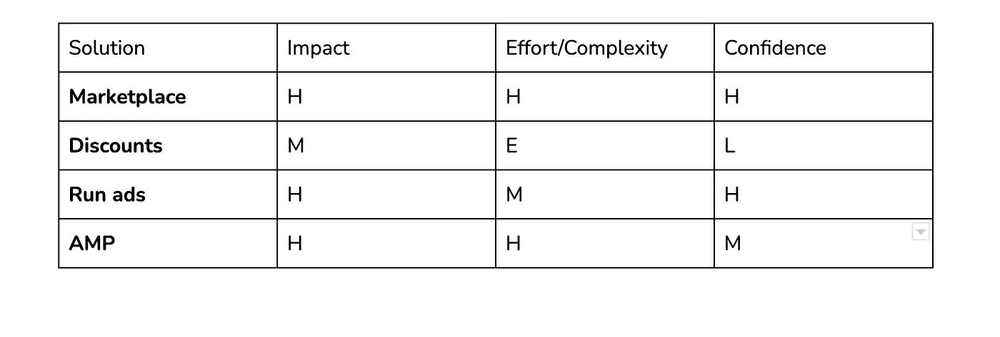
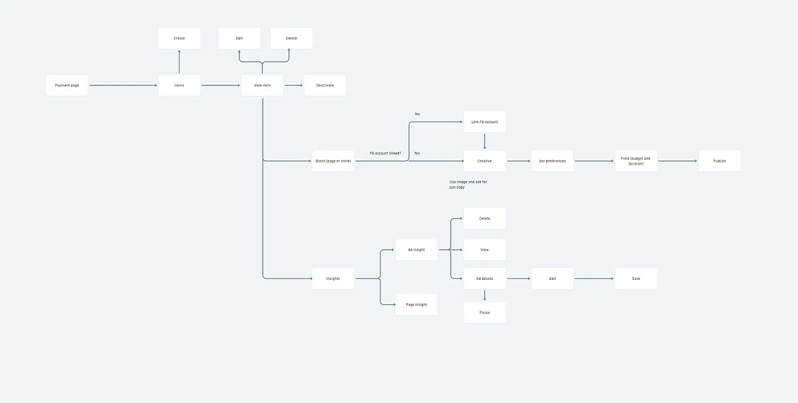

[Paystack’s](https://paystack.com) sweeping goal is to help African businesses get paid by anyone, anywhere in the world. In particular, however, [Paystack Commerce](https://paystack.com/commerce) is a toolkit for African creators to bring ideas to market seamlessly. It’s easy to set up, and creators can begin selling their products with just a few steps.

Paystack built Paystack Commerce to help African creators who have businesses get paid.

## Initial thoughts

[Paystack Commerce](https://paystack.com/commerce) has been around for a while. It was launched over a year ago to much fanfare. Although I have no insider knowledge about the product, it looks like it has seen decent traction.

My approach here would be to:

*   Define the goal of the proposed ‘improvements‘ to Paystack. Essentially, the “what” and “why”?
*   Identify relevant segments of users that need Paystack Commerce.
*   Prioritise for solving the needs of a segment and propose relevant solutions
*   Focus on a solution and walk you guys through my thought process, key actions, and flow.
*   Finally, I’d summarise and conclude.

To define the goal, let’s look at the vital metrics (Acquisition, Engagement and Retention) that we should be concerned with improving at a high level. This would help us narrow down what we should improve and why.

1.  **Acquisition**: How many creators are currently using Paystack Commerce? Is there an opportunity to serve and attract more creators?
2.  **Engagement**: How engaged are our creators? Is there an opportunity to provide more so we can get them hooked? Can we bring creators deeper into our ecosystem? Do we need to improve the frequency of times creators interact with Paystack Commerce?
3.  **Monetisation**: Are there opportunities to earn more per creator that we should consider? Is there anything we are leaving on the table regarding the value we aren’t capturing? Can we provide additional value to get more revenue per creator?

For Paystack Commerce, we definitely shouldn’t be looking at more monetisation opportunities because of the product’s current stage — you know, it’s still early days. Instead, I would consider focusing on acquisition because the product is still in its growth phase, where there’s still a huge need for growth and a lot of room for that growth to happen.

## Identify segments

Next, let’s look at the relevant user segments:

*   **Creators that sell physical goods**: Think of a creator who sells fashion items that wants to grow her business or a gadget entrepreneur who sells electronic gadgets (phones). The big problem they face is difficulty attracting more customers and increasing sales.
*   **Creators who manage events (sell tickets and all that)**: One colossal problem event creators face (especially in the face of COVID) is putting together and hosting paid live events.
*   **Lastly, creators that sell digital products,** e.t.c (books, courses, and exclusive content), can’t host their digital content. This is a big problem, and most creators are opting for makeshift solutions like a WhatsApp group plus their account number.

## Prioritise User Segment and Identify Needs

For this improvement, we would be prioritising creators who sell physical goods like clothing. This decision is based on the fact that this segment is huge and has massive potential. Arguably, the largest percentage of commerce in the country and continent comes from this segment. But, more importantly, the segment lacks excellent solutions — sort of like an industry with a high [Total Addressable Market (TAM)](https://www.productplan.com/glossary/total-addressable-market/) **but** low [Customer Satisfaction Score (CSAT)](https://blog.hootsuite.com/csat-score/).

Although the other segments have problems that also need solutions, I’d argue that the TAM in Nigeria and Africa for those segments is smaller relative to the segment I have picked.

[\[Because I had time on my side while writing this, I thought about other ways I could have approached this question: with the focus being on how to approach the question and what problem to solve. This is interesting because at the end of the day, I discovered that I would have focused on solving the same problem whichever route I went\]](https://docs.google.com/document/u/0/d/1IKJn4Noqf_xlaLhUTS57ZeTepYVDoSxv6nD47nt6a3g/edit). Click the article to read more about these alternate approaches.

## Propose Solutions

I’d suggest solutions to the problem facing creators that sell physical goods. I’d majorly be looking at ways to help these creators grow their sales and attract more customers. Hopefully, these solutions should solve the problem of distribution for creators in the segment we prioritised. My proposed solutions are outlined below:

### A Marketplace

The marketplace would be an aggregation of all stores on Paystack Commerce (starting with those that sell specific stuff like clothing). We will introduce a **“Discover”** section, and creators opt-in to feature items from their stores.

The goal would be to use the “Discover” section as a customer acquisition channel for creators using Paystack Commerce to bring their ideas to market.

One issue with the marketplace is that aggregating all the categories (think of clothing and food) at the beginning would be a struggle, except we start with one or a few specific categories, as I said.

### Facebook Ad Integration.

Creators can promote their pages and storefronts directly from Paystack. This would be useful and used for driving traffic to their page (items). Our initial focus would be on ‘boosting’ your store and page.

For the [minimum viable product (MVP)](https://danieltorkura.medium.com/mvp-for-beginners-53f517be51af), the goal would be to focus on Facebook only and allow creators to push ads to millions with the push of a button.

If we go with this solution, the broader goal would be to allow users to push their stores across multiple digital channels right from their Paystack account.

We could provide free Facebook credits to this offering as an added incentive.

### Offer Discounts

We would allow creators to incentivise user purchase behaviour by creating offers. Every offer created will generate a coupon code that, once validated at checkout, customers can get an amount off based on what the creator specifies.

### Affiliate marketing program

Creators can get help from people to generate demand for their products in exchange for a cut in the sale. They need to create affiliate links for their products and share them with affiliates, among other things.

The affiliate marketing feature will enable the users who affiliate for products to get affiliate links and automatically get a cut whenever a sale is made through those links.

## Prioritise a Solution

All the solutions listed look good, but I’d like to focus on one to help us achieve our goal here.

To do this, I listed some parameters — \[a\] impact of the proposed solution, \[b\] effort/complexity involved and \[c\]confidence in the solution — to help us decide which to go for, and will be assigning them scores using the system below:

*   H — High
*   M — Medium
*   E — Easy

<!--  -->

I think allowing creators to run ads (on FB and then on other channels) stands out based on the framework and its alignment with Paystack Commerce’s vision to enable creators to seamlessly bring ideas beautifully to market (perfectly suits what Paystack Commerce is). Additionally, it increases the likelihood that businesses will get paid (this aligns with Paystack’s mission to help African businesses get paid).

## Flow

Let’s delve into how this solution is going to work. First, a little on the copy:

Grow your sales! Set up your store and reach thousands of users instantly when you activate FB ads directly from your store page (dashboard).

Key components would be:

*   Users can link their FB accounts.
*   Promote — Boost (page — item). We would ask the user vital questions needed to set up, around adding target, audience, e.t.c. Creators can manage ads from here, including funding an ad.
*   Analytics: Users can see insights and ad performance once the ad has enough data right from their Paystack dashboard.

<!--  -->

*Fb _ad_flow*

Click on this [link](https://whimsical.com/paystack-commerce-QhNLewReDeXSyLfcEK1wKS) to get a more detailed view of the flow above.

## Metrics

In essence, what parameters would be used to judge how successful the feature has been.

The leading metric, the [North Star Metric](https://mixpanel.com/blog/north-star-metric/), would be the number of payment pages (products) that new users promote within their first month. Some other [proxy metrics](https://gibsonbiddle.medium.com/4-proxy-metrics-a82dd30ca810) that may also count would be:

*   The number of payment page visits from Facebook.
*   The number of products sold via Facebook.
*   Total Gross Merchandise Value (GMV) of products sold via Facebook.

## Conclusion

Paystack helps businesses in Africa get paid by anyone, anywhere globally. But unfortunately, these businesses (especially those using Paystack Commerce to bring their ideas to life) have a hard time growing (finding customers). Launching this feature will allow creators to push their businesses in front of thousands, if not millions, of prospective buyers who can help creators solve this problem.

As with any solution, this isn’t without [tradeoffs](https://every.to/divinations/trade-offs-are-your-friend-208594). Let’s look at some of them.

*   It might not suit advanced users — for a more sophisticated user, the ad manager might still be the best alternative. Because this is a stripped-down version (MVP), there’s no retargeting and all you get with a full-scape FB ad manager.
*   Users might begin to associate the effectiveness of the ad and the performance of their business with the platform when things don’t go well. Also, most times, the efficacy of an ad is based on the expertise of the person running the ad. We can solve this by focusing a lot on educating users about running effective ads on Facebook.
*   The rising cost of ads: Running ads might not be cost-effective for someone just starting, especially in the face of [Apple’s iOS restrictions on ads.](https://www.facebook.com/business/apple-ios-14-speak-up-for-small-business/impact-on-ads-marketing)

The End😎!